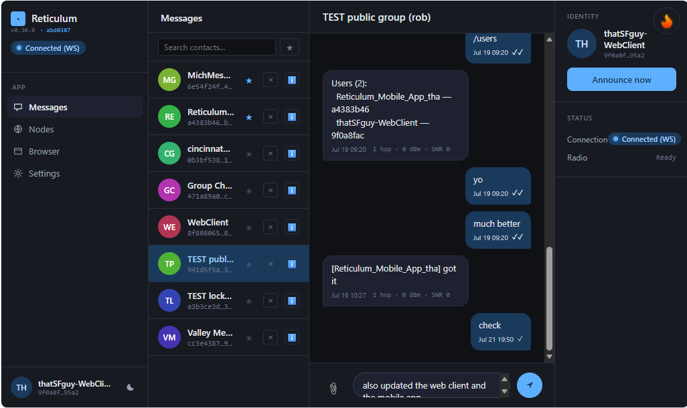
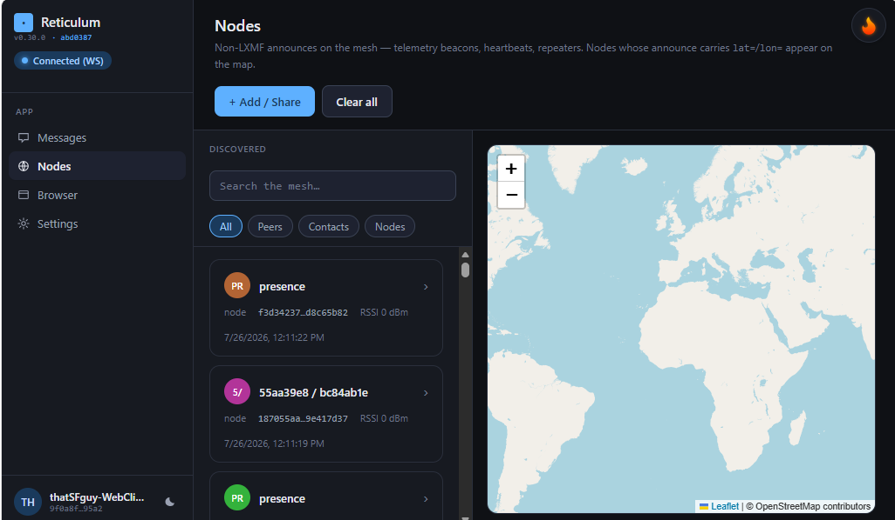
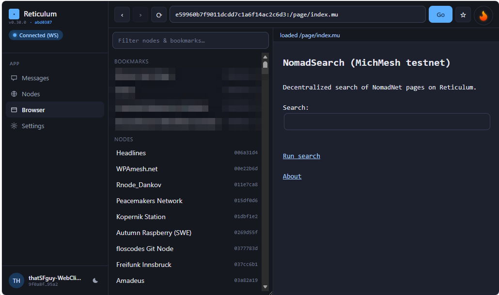
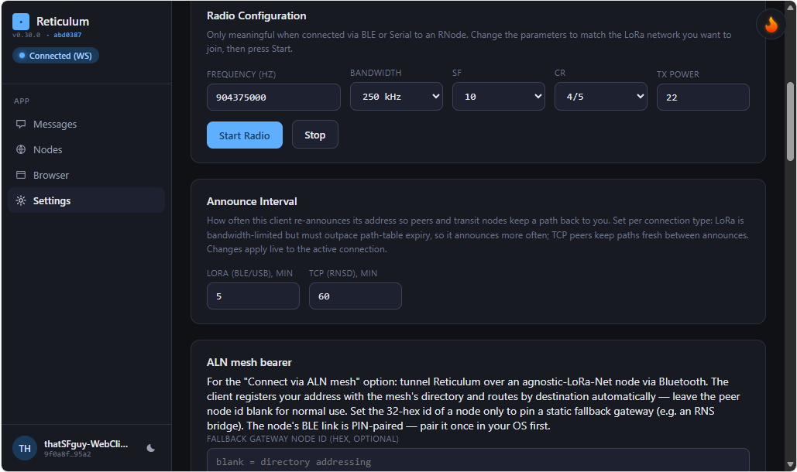
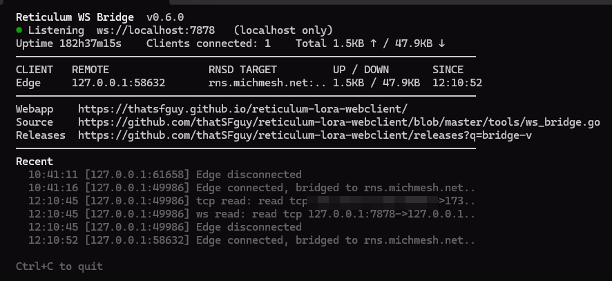

# reticulum-webclient

A browser-based Reticulum messaging client. Connects either directly to an [RNode](https://unsigned.io/rnode) LoRa modem over Web Bluetooth or Web Serial, or to any running Reticulum daemon (`rnsd`) over a WebSocket bridge, and exchanges encrypted LXMF messages — including file and image attachments — with Sideband, NomadNet, MeshChat, and other Reticulum nodes anywhere on the network. It also browses NomadNet pages.

**Live app:** <https://thatsfguy.github.io/reticulum-webclient/>

Nothing to install for the app itself — it's a static page. Your identity, contacts, and messages stay in your browser; only encrypted packets ever leave it.

## Screenshots

| Messages | Nodes |
|---|---|
|  |  |

| NomadNet browser | Settings |
|---|---|
|  |  |

The Go WebSocket bridge (`tools/ws_bridge.go`) bridging a browser to a public `rnsd` transport node:

## Features

- **End-to-end encrypted messaging** with Sideband, MeshChat, NomadNet, and any other LXMF client — text, file and image attachments, emoji reactions, and reply threading. Per-message delivery states (sending → sent ✓ → delivered ✓✓).
- **Three ways onto the network:** an RNode LoRa modem over Bluetooth or USB (no internet, no server), any `rnsd` daemon over a small WebSocket bridge (works in every browser, including iOS), or an agnostic-LoRa-Net BLE mesh node.
- **NomadNet browser** — pages, links, forms, tables, and file downloads, with bookmarks and history.
- **Nodes view** — everything announcing on the mesh (repeaters, telemetry beacons, other clients), with a map for nodes that broadcast a position.
- **Contact sharing** — QR code, contact-card text, or a bare destination hash (the app fetches the peer's key from the network automatically).
- **Your identity is yours** — generated in the browser, stored locally, exportable/importable as a file. No accounts, no server, no phone number.

## Getting started

### With an RNode (LoRa, no internet needed)

1. Open the [live app](https://thatsfguy.github.io/reticulum-webclient/) in Chrome, Edge, or Brave.
2. Click **Connect (BLE)** and pick your RNode — or plug it in over USB and use **Connect (Serial)** on desktop. The app detects the modem and starts the radio with the values in the Radio Configuration panel (set frequency/bandwidth/SF/CR to match your local network first).

### Without a radio (WebSocket, any browser)

Works everywhere — including Safari, Firefox, and iOS — by joining the network through a Reticulum daemon:

1. Download the small bridge program via the in-app **Connect via TCP → Download the bridge** button and run it. It listens on `ws://localhost:7878`.
2. Click **Connect (WebSocket)**. The daemon field comes prefilled with a public Reticulum hub, so you can just connect — or point it at your own `rnsd`.

Full walkthrough — running your own `rnsd`, TLS/`wss://`, the mixed-content caveat, and troubleshooting — in **[docs/TCP-BRIDGE.md](docs/TCP-BRIDGE.md)**.

### First steps once connected

1. **Set your display name** and click **Send Announce** — this tells the network how to reach you. Your address is under *Your Identity*.
2. **Wait for announces** — other nodes appear in the contact list and Nodes view as they announce.
3. **Open a conversation** — click a contact, type, hit Enter. Or add a contact directly from their QR code / contact card / destination hash via **+ Add / Share**.
4. **Back up your identity** — *Export Identity* saves your keys as a file. Treat it like a password; anyone with the file can impersonate you.

To browse NomadNet, open the **Browser** view and pick a node from the directory (or paste a node hash).

## Platform support

| Platform            | Web Bluetooth | Web Serial | WebSocket (TCP via bridge) | Works? |
|---------------------|---------------|------------|----------------------------|--------|
| Chrome Android      | Yes           | No         | Yes                        | Primary target |
| Chrome/Edge desktop | Yes           | Yes        | Yes                        | Dev and daily use |
| Brave desktop       | Yes           | Yes        | Yes                        | Works |
| Safari (iOS/macOS)  | No            | No         | Yes                        | WebSocket only |
| Firefox             | No            | No         | Yes                        | WebSocket only |

WebSocket works everywhere, which is the practical way to use the client from Safari, Firefox, or iOS. The LoRa-over-RNode paths need a browser with Web Bluetooth or Web Serial, and an HTTPS page (or `http://localhost`).

## What it does not do (yet)

- **No store-and-forward** (propagation nodes): both parties must be on the network at the same time.
- **No multi-hop transport routing**: this is a leaf node, not a relay.
- Some NomadNet corners: server-side includes render as placeholders; no identify-on-connect for auth-gated pages.

## Privacy and security in brief

- Message content is end-to-end encrypted (Reticulum's standard ECDH + HKDF + AES-256-CBC + HMAC scheme, with ratchet rotation on every announce). Bridges, daemons, and relays only ever see encrypted packets.
- Your private keys live **unencrypted in the browser's IndexedDB**, and the exported identity file is unencrypted JSON — protect both like passwords.
- Reticulum metadata (destination hashes, your display name, announce timing) is visible to network observers by protocol design, even though content is not.
- Use `wss://` rather than `ws://` for any bridge connection beyond localhost.

Full trust model, protections, and limitations: **[docs/SECURITY.md](docs/SECURITY.md)**.

## For developers

- **[docs/DEVELOPMENT.md](docs/DEVELOPMENT.md)** — running from source (any static file server; no build step), architecture, module layout, diagnostic tools, implementation notes.
- **[docs/PROTOCOL_NOTES.md](docs/PROTOCOL_NOTES.md)** — the accumulated Reticulum / LXMF interop findings.
- **[CLAUDE.md](CLAUDE.md)** — scope rules and the implemented protocol surface.

## Related projects

- [reticulum-rnode](https://github.com/thatSFguy/reticulum-rnode) — the RNode firmware this client talks to.
- [reticulum-lora-repeater](https://github.com/thatSFguy/reticulum-lora-repeater) — a repeater node built on the same LoRa stack; also the firmware behind this repo's [flasher page](https://thatsfguy.github.io/reticulum-webclient/flasher.html).
- [markqvist/Reticulum](https://github.com/markqvist/Reticulum) — upstream Python Reticulum.
